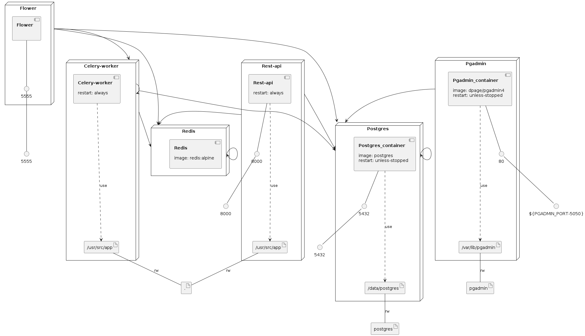

# docker-celery

Getting started

docker-compose contains all required containers. 

- Start the postgres container and pgadmin container first.
- Access pgadmin after starting via http://localhost:5050/browser/ password is changeme.
- Create a database user called hitman with a password hitman. Superuser access required. 
- Create a database called hitman_db and grant hitman user permission. 
- After doing so run the rest-api container once hitman_db database has been setup and running.
- Visit http://localhost:8000/hitmen/start-job to start a job, monitor celery logs to watch processing.
- Visit http://localhost:5555/ for celery flower.
- `celery -A findmyhitman worker --beat --loglevel=DEBUG --scheduler django_celery_beat.schedulers:DatabaseScheduler`
- `docker run -dp 3000:3000 hitman/webapp`

### Infrastructure model

